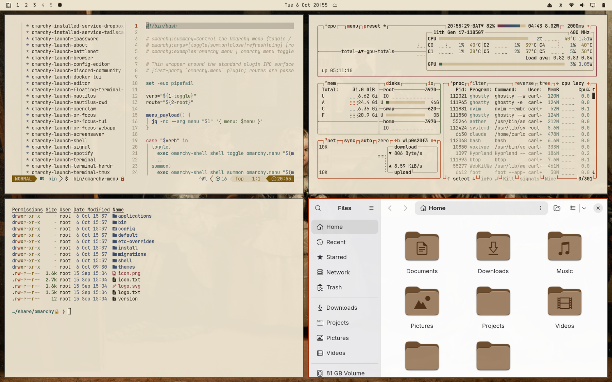
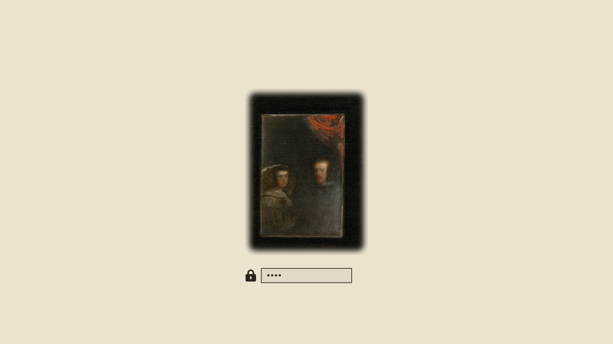

# Las Meninas (claro / light) — Omarchy theme

*[Español](#español) · [English](#english)*



---

## Español

Yo, Dalí, he hecho lo que Velázquez no se atrevió a hacer: ¡he abierto todas las ventanas del Alcázar! La luz del mediodía entra a raudales en el obrador y lo que era penumbra se vuelve marfil, el marfil sublime del vestido de la Infanta. Pero no os engañéis: el aire sigue ahí, ese aire divino que Velázquez pintó entre las figuras, ahora transparente como una gota de agua al sol.

En este marfil, cada color es un pigmento robado al cuadro: el bermellón de los lazos, el oro del cabello de la Infanta, el verde de la falda de María Agustina, el pizarra de Mari Bárbola, el carmín de Nicolasito. Y el espejo sigue colgado al fondo. A plena luz, los Reyes os ven todavía mejor.

*Texto escrito a la manera de Salvador Dalí, admirador devoto de Velázquez. No es una cita suya.*

Un tema claro para [Omarchy](https://omarchy.org) basado en *Las Meninas* (1656), Museo del Prado. Todos los colores están ajustados para leerse con buen contraste sobre el fondo (WCAG 4,5:1).

También existe la versión oscura original: [Las Meninas](https://github.com/carloschida/omarchy-las-meninas-theme).

### Instalación

```bash
omarchy theme install https://github.com/carloschida/omarchy-las-meninas-light-theme
```

Después, elígelo en el selector de temas o ejecuta `omarchy theme set las-meninas-light`.

### Fondos de pantalla

Ocho encuadres de la pintura en 4K (3840 × 2400), recortados del escaneo en gigapíxeles del Museo del Prado:

1. La familia de Felipe IV
2. Velázquez, la Infanta y el espejo
3. El espejo de los Reyes y José Nieto
4. El aire y el lienzo
5. El autorretrato de Velázquez
6. Mari Bárbola y Nicolasito Pertusato
7. El mastín
8. Isabel de Velasco y los guardadamas

Los fondos son 16:10 y están compuestos para que nada importante se pierda en pantallas 16:9: caras y detalles quedan dentro del 90 % central de la altura. Cambia de fondo con `omarchy theme bg next`.

### Extras

- **Pantalla de desbloqueo** (`unlock.png`): el espejo con el reflejo de Felipe IV y Mariana de Austria. Actívala con `omarchy plymouth set by theme las-meninas-light`.
- **Teclado RGB** (`keyboard.rgb`): el bermellón de los lazos de la Infanta, para portátiles compatibles.



### Créditos y licencia

*Las Meninas*, Diego Velázquez, 1656. Óleo sobre lienzo, 318 × 276 cm. Museo del Prado, Madrid.
Imágenes a partir del escaneo de [Wikimedia Commons](https://commons.wikimedia.org/wiki/File:Las_Meninas,_by_Diego_Vel%C3%A1zquez,_from_Prado_in_Google_Earth.jpg) (Prado en Google Earth). La obra y sus reproducciones fieles son de **dominio público**.

Los archivos del tema (colores, configuración y este README) se publican bajo la [licencia MIT](LICENSE). Las imágenes no están sujetas a esa licencia: son de dominio público.

---

## English

I, Dalí, have done what Velázquez never dared to do: I have thrown open every window of the Alcázar! The noonday light pours into the studio, and what was gloom becomes ivory, the sublime ivory of the Infanta's dress. But make no mistake: the air is still there, that divine air Velázquez painted between the figures, now as transparent as a drop of water in the sun.

On this ivory, every colour is a pigment stolen from the painting: the vermilion of the ribbons, the gold of the Infanta's hair, the green of María Agustina's skirt, the slate of Mari Bárbola, Nicolasito's carmine. And the mirror still hangs at the back. In broad daylight, the King and Queen see you even better.

*Written in the manner of Salvador Dalí, a devoted admirer of Velázquez. Not a quotation of his.*

A light theme for [Omarchy](https://omarchy.org) based on *Las Meninas* (1656), Museo del Prado. Every colour is tuned for readable contrast on the background (WCAG 4.5:1).

There is also the original dark version: [Las Meninas](https://github.com/carloschida/omarchy-las-meninas-theme).

### Installation

```bash
omarchy theme install https://github.com/carloschida/omarchy-las-meninas-light-theme
```

Then pick it in the theme switcher or run `omarchy theme set las-meninas-light`.

### Wallpapers

Eight crops of the painting in 4K (3840 × 2400), cut from the Museo del Prado's gigapixel scan. Titles are in Spanish:

1. La familia de Felipe IV — *The Family of Philip IV*
2. Velázquez, la Infanta y el espejo — *Velázquez, the Infanta and the mirror*
3. El espejo de los Reyes y José Nieto — *The King and Queen's mirror and José Nieto*
4. El aire y el lienzo — *The air and the canvas*
5. El autorretrato de Velázquez — *Velázquez's self-portrait*
6. Mari Bárbola y Nicolasito Pertusato — *Mari Bárbola and Nicolasito Pertusato*
7. El mastín — *The mastiff*
8. Isabel de Velasco y los guardadamas — *Isabel de Velasco and the chaperones*

The wallpapers are 16:10 and composed so nothing important is lost on 16:9 screens: faces and details stay inside the middle 90% of the height. Cycle through them with `omarchy theme bg next`.

### Extras

- **Unlock screen** (`unlock.png`): the mirror with the reflection of Philip IV and Mariana of Austria. Enable it with `omarchy plymouth set by theme las-meninas-light`.
- **RGB keyboard** (`keyboard.rgb`): the vermilion of the Infanta's ribbons, for supported laptops.

### Credits and license

*Las Meninas*, Diego Velázquez, 1656. Oil on canvas, 318 × 276 cm. Museo del Prado, Madrid.
Images from the [Wikimedia Commons](https://commons.wikimedia.org/wiki/File:Las_Meninas,_by_Diego_Vel%C3%A1zquez,_from_Prado_in_Google_Earth.jpg) scan (Prado in Google Earth). The painting and faithful reproductions of it are in the **public domain**.

The theme files (colours, configuration and this README) are released under the [MIT License](LICENSE). The images are not covered by that license: they are in the public domain.
